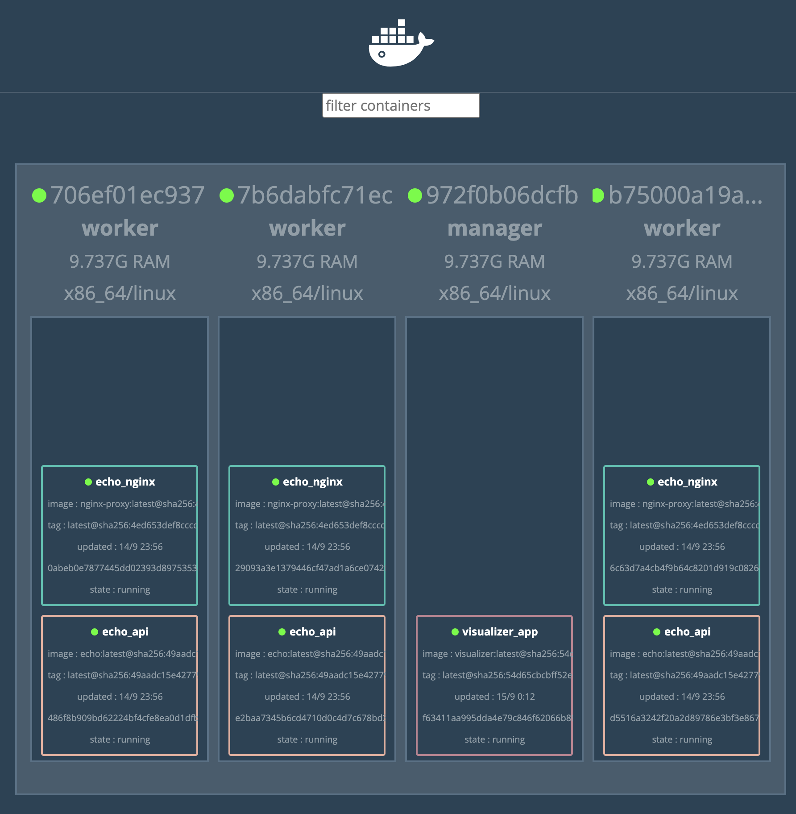

# 초보자를 위한 도커 스웜
> 도커 스웜은 여러 도커 호스트를 클러스터로 묶어주는 컨테인너 오케스트레이션 도구 중에 하나입니다. 기본적으로 여러 호스트에 설치가 되어야만 도커스웜을 통한 배포 및 테스트가 가능하며 이는 docker machine 을 통해 배포할 수 있으나, 맥 환경에서는 virtualbox 드라이버, 윈도우에서는 hyperv 드라이버가 각가 필요하므로 테스트하기에는 불편한 환경이기는 마찬가지 입니다. 그러므로 개발환경에서 도커 스웜을 테스트 하기 위해 구성된 것이 도커 인 도커(Docker in docker, dind)라는 기능이며 본 실습에서는 dind 를 활용하여 배포 및 테스트를 수행합니다.


## 1. 레퍼런스
* [도커/쿠버네티스를 활용한 컨테이너 개발 실전 입무](https://wikibook.co.kr/docker-kubernetes/)
* [DockerCloud/HAProxy](https://hub.docker.com/r/dockercloud/haproxy)
* [Practical Design Patterns in Docker Networking](https://www.slideshare.net/Docker/practical-design-patterns-in-docker-networking-81017903)


## 2. 도커 서비스를 통한 빌드 및 배포
> 로컬에서 빌드된 이미지를 배포하고, 해당 이미지를 서비스, 배포, 스케일 및 삭제를 실습합니다

### 2-1. 여러 대의 도커 호스트로 스웜 클러스터 구성하기
* dind 를 통해 컨테이너 안에 5개의 역할 별 컨테이너를 구성합니다
  - registry x 1 : 해당 컨테이너 내에서만 관리되는 이미지 레지스트리 (로컬에 저장되는 이미지와 별도로 등록이 필요합니다)
  - manager x 1  : 스웜 클러스터 전체를 관리하는 역할의 컨테이너
  - worker x 3   : 실제 노드로 동작하는 워커 컨테이너
* 이 환경을 도커 컴포즈 환경으로 구성합니다
  - 도커 레지스트리는 https 통신이 필요하지만 편의상 http 를 사용하기 위해 --insecure-registry registry:5000 으로 등록합니다
```yaml
version: "3"
services:
  registry:
    container_name: registry
    image: registry:2.6
    ports:
      - 5000:5000
    volumes:
      - "./registry-data:/var/lib/registry"

  manager:
    container_name: manager
    image: docker:18.05.0-ce-dind
    privileged: true
    tty: true
    ports:
      - 8000:80
      - 9000:9000
    depends_on:
      - registry 
    expose:
      - 3375
    command: "--insecure-registry registry:5000"
    volumes:
      - "./stack:/stack"

  worker01:
    container_name: worker01
    image: docker:18.05.0-ce-dind
    privileged: true
    tty: true
    depends_on:
      - manager
      - registry 
    expose:
      - 7946
      - 7946/udp
      - 4789/udp
    command: "--insecure-registry registry:5000"

  worker02:
    container_name: worker02
    image: docker:18.05.0-ce-dind
    privileged: true
    tty: true
    depends_on:
      - manager
      - registry 
    expose:
      - 7946
      - 7946/udp
      - 4789/udp
    command: "--insecure-registry registry:5000"

  worker03:
    container_name: worker03
    image: docker:18.05.0-ce-dind
    privileged: true
    tty: true
    depends_on:
      - manager
      - registry 
    expose:
      - 7946
      - 7946/udp
      - 4789/udp
    command: "--insecure-registry registry:5000"
```
* 도커 컴포즈 실행을 통해 컨테이너를 기동합니다
  - 컨테이너 실행 직후에는 여전히 연동된 상태는 아니며 별도의 초기화가 필요합니다
```bash
bash>
docker-compose up -d
```
* 매니저를 등록하고, 모든 워커 노드들을 추가한 후, 확인합니다.
  - swarm init 명령어를 통해 매니저 초기화가 수행되고 *해당 호스트는 manager 로 마킹되고 스웜 모드가 활성화*됩니다
  - 활성화 이후에 토큰 키를 저장해 두었다가 해당 토큰을 통해 개별 워커 노드를 추가할 수 있습니다
```bash
bash>  # 스웜 매니저를 초기화합니다
docker container exec -it manager docker swarm init

# Swarm initialized: current node (jriglndy20y71e84odbze5gfj) is now a manager.
# To add a worker to this swarm, run the following command:
#     docker swarm join --token SWMTKN-1-3iyxi7cex388h7jbr6twri4mpj6uxocyuiouh17vcdc5m0ngv9-7lbdl4vspf9117bqn8ilxwiox 172.21.0.3:2377
# To add a manager to this swarm, run 'docker swarm join-token manager' and follow the instructions.


bash>  # 개별 워커들을 추가합니다 (01 ~ 03)
docker container exec -it worker01 docker swarm join \
--token SWMTKN-1-3iyxi7cex388h7jbr6twri4mpj6uxocyuiouh17vcdc5m0ngv9-7lbdl4vspf9117bqn8ilxwiox \
manager:2377

# This node joined a swarm as a worker.

bash>  # 클러스터의 상태를 확인합니다
docker container exec -it master docker node ls

# ID                            HOSTNAME            STATUS              AVAILABILITY        MANAGER STATUS      ENGINE VERSION
# ccb6heujzdns8yyliusug5tfr     7b6dabfc71ec        Ready               Active                                  18.05.0-ce
# rr5u01k47b7w0z875xa3c344n     706ef01ec937        Ready               Active                                  18.05.0-ce
# jriglndy20y71e84odbze5gfj *   972f0b06dcfb        Ready               Active              Leader              18.05.0-ce
# z9kzzusf61f2p9sbf0v0x19mz     b75000a19a16        Ready               Active                                  18.05.0-ce
```

### 2-2. 도커 레지스트리에 이미지 등록하기
> 아주 간단한 에코 도커 이미지를 로컬에서 빌드하고, DinD 내부의 레지스트리에 해당 이미지를 image tag 명령어를 통해 등록할 수 있습니다

* Go 언어를 이용한 간단한 도커 이미지를 작성합니다
```bash
bash> cat ./Dockerfile
FROM golang:1.9

RUN mkdir /echo
COPY main.go /echo

CMD ["go", "run", "/echo/main.go"]


bash> cat ./main.go
package main

import (
    "fmt"
    "log"
    "net/http"
)

func main() {
    http.HandleFunc("/", func(w http.ResponseWriter, r *http.Request) {
        log.Println("received request")
        fmt.Fprintf(w, "Hello Docker!!")
    })

    log.Println("start server")
    server := &http.Server{Addr: ":8080"}
    if err := server.ListenAndServe(); err != nil {
        log.Println(err)
    }
}
```
* 도커 이미지를 빌드 후, 레지스트리에 등록합니다
  - 빌드된 로컬 태그를 latest 태그를 다시 부여합니다 (편의상)
  - 빌드된 이미지를 로컬 레지스트리(PORT: 5000)를 포함한 태그를 다시 부여합니다.
  - 태그포맷 -> [레지스트리\_호스트/]리포지토리명[:태그] : "여기서 레지스트리\_호스트"란 이미지를 등록하거나 내려받는 레지스트리를 의미합니다
```bash
bash>
docker build tag -t psyoblade/echo:local .
docker image tag psyoblade/echo:local psyoblade/echo:latest

# Successfully tagged psyoblade/echo:local


bash>
docker image tag psyoblade/echo:latest localhost:5000/psyoblade/echo:latest
docker image push localhost:5000/psyoblade/echo:latest 
...
latest: digest: sha256:49aadc15e427798c49c58bba3d39996ea9ebff5e873cae02923a42f086f1d3b4 size: 2418
```


### 2-3. 개별 워커 컨테이너에서 이미지를 내려받습니다
> 레지스트리에 등록된 에코 이미지를 개별 워커에서 내려받아 사용할 준비를 합니다

* 도커 이미지 내려받고, 확인해보기
```bash
docker container exec -it worker01 docker pull registory:5000/psyoblade/echo:latest
docker container exec -it worker01 docker image ls
```


### 2-4. 도커 서비스를 통한 클러스터 이미지 배포
> 단일 도커 호스트의 경우 run 명령을 통해 기동 및 제어를 할 수 있었지만, 클러스터에서는 service 명령을 통해서 제어가 가능합니다.

* 등록된 에코 이미지를 이용하여 서비스를 생성합니다
  - 이미지를 배포하고, 확인합니다
  - 레플리카 수를 1에서 3으로 늘립니다
```bash
bash>  # 도커 서비스를 통한 이미지 배포
docker container exec -it manager \
docker service create --replicas 1 --publish 8000:8080 --name echo registry:5000/psyoblade/echo:latest

# 5mdcdgy452sdo5otn7brs4733
# overall progress: 0 out of 1 tasks
# 1/1: preparing [=================================>                 ]


bash>  # 도커 서비스를 통해 제대로 배포되었는지 확인합니다
docker container exec -it manager docker service ls
ID                  NAME                MODE                REPLICAS            IMAGE                                 PORTS
5mdcdgy452sd        echo                replicated          1/1                 registry:5000/psyoblade/echo:latest   *:8000->8080/tcp


bash>  # 레플리카 수를 1에서 3으로 늘립니다
docker continaer exec -it manager \
docker service update --replicas 3 echo

# echo
# overall progress: 2 out of 3 tasks
# 1/3: preparing [=================================>                 ]
# 2/3: running   [==================================================>]
# 3/3: running   [==================================================>]


bash>  # 배포된 서비스를 확인합니다
docker container exec -it manager docker service ls

# ID                  NAME                MODE                REPLICAS            IMAGE                                 PORTS
# 5mdcdgy452sd        echo                replicated          3/3                 registry:5000/psyoblade/echo:latest   *:8000->8080/tcp
```

* 이번에는 스케일링 명령을 통해 레플리카 수를 조정합니다
  - ps 명령어를 통해 모든 프로세스를 확인합니다
```bash
bash>  # scale 명령을 통해 3에서 6으로 조정합니다
docker container exec -it manager \
docker service scale echo=6

# echo scaled to 6
# overall progress: 4 out of 6 tasks
# 1/6: running   [==================================================>]
# 2/6: running   [==================================================>]
# 3/6: running   [==================================================>]
# 4/6: preparing [=================================>                 ]
# 5/6: running   [==================================================>]
# 6/6: preparing [=================================>                 ]


bash>  # 서비스 상태를 확인합니다
docker container exec -it manager docker service ps  echo

# ID                  NAME                IMAGE                                 NODE                DESIRED STATE       CURRENT STATE            ERROR               PORTS
# yacps12i3hkz        echo.1              registry:5000/psyoblade/echo:latest   972f0b06dcfb        Running             Running 5 minutes ago
# w5vr5rdsujn4        echo.2              registry:5000/psyoblade/echo:latest   706ef01ec937        Running             Running 3 minutes ago
# mnlfgoio4qss        echo.3              registry:5000/psyoblade/echo:latest   b75000a19a16        Running             Running 2 minutes ago
# uxs1w5ysxghs        echo.4              registry:5000/psyoblade/echo:latest   7b6dabfc71ec        Running             Running 20 seconds ago
# je44ca5w47ar        echo.5              registry:5000/psyoblade/echo:latest   7b6dabfc71ec        Running             Running 21 seconds ago
# 47ggti119ys0        echo.6              registry:5000/psyoblade/echo:latest   b75000a19a16        Running             Running 35 seconds ago
```


### 2-5. 모든 컨테이너를 제거합니다

* 서비스 제거(rm) 명령을 통해 서비스를 종료합니다
```bash
bash>  # service rm <서비스명> 을 통해 삭제합니다
docker container exec -it manager \
docker service rm echo
```


## 3. 스택을 통한 서비스 그룹 관리
> 스택은 하나 이상의 서비스를 그룹으로 묶은 단위로 애플리케이션 전체 구성을 정의할 수 있습니다. 도커 서비스가 도커라고 하면 도커 스택은 도커 컴포즈의 레벨입니다. 스택을 통해 배포된 서비스 그룹은 overlay 네트워크에 속하는데, overlay 네트워크란 여러 도커 호스트에 걸쳐 배포된 컨테이너 그룹을 같은 네트워크에 배치하기 위한 기술입니다.


### 3-1. 오버레이 네트워크 생성
> 해당 서비스의 컨테이너들 사이의 네트워크를 사전에 생성하고 스텍을 통핸 서비스를 배포합니다

* 오버레이 네트워크 localnet 을 생성합니다
  - 생성 후 컨테이너를 붙이기 위해 --attachable 옵션을 추가합니다
```bash
docker container exec -it manager \
docker network create --driver=overlay --attachable localnet
```

### 3-2. 스택을 통한 서비스 배포
* 스택을 위한 yaml 파일을 생성합니다
  - 프록시를 위한 nginx 서버와, 에코 서버를 하나의 서비스로 구성했습니다
```yaml
version: "3"
services:
  nginx:
    image: gihyodocker/nginx-proxy:latest
    deploy:
      replicas: 3
      placement:
        constraints: [node.role != manager]
    environment:
      SERVICE_PORTS: 80
      BACKEND_HOST: echo_api:8080
    depends_on:
      - api
    networks:
      - localnet
  api:
    image: registry:5000/example/echo:latest
    deploy:
      replicas: 3
      placement:
        constraints: [node.role != manager]
    networks:
      - localnet

networks:
  localnet:
    external: true
```
* 생성된 스택 파일을 통해 서비스를 배포합니다
  - deploy 명령과 -c 옵션을 통해 yaml 파일을 지정합니다
  - 배포시에 서비스명인 echo 를 지정하면 echo\_{서비스명} 으로 이름이 자동 생성됩니다
  - manager 컨테이너의 경우 ./stack 경로가 컨테이너 내부의 /stack 으로 bind volume 으로 마운트되어 있습니다
```bash
bash>
docker container exec -it manager \
docker stack deploy -c /stack/docker-stack.yml echo

# Creating service echo_nginx
# Creating service echo_api
```
* 배포된 스택을 확인합니다
  - 배포된 컨테이너는 ps 명령을 통해 확인합니다 
  - 여러개의 서비스가 존재하므로 반드시 서비스 명을 입력해야 합니다
```bash
bash>  # 스택의 경우 서비스들(servcies) 입니다
docker exec -it manager docker stack services echo

# ID                  NAME                MODE                REPLICAS            IMAGE                                 PORTS
# ce4gkipnwehy        echo_api            replicated          3/3                 registry:5000/psyoblade/echo:latest
# wzbuv8lqm04b        echo_nginx          replicated          3/3                 gihyodocker/nginx-proxy:latest


bash>  # ps 명령을 통해 스택 서비스를 확인합니다
docker exec -it manager docker stack ps echo

# ID                  NAME                IMAGE                                 NODE                DESIRED STATE       CURRENT STATE           ERROR               PORTS
# r6d14c7tqk00        echo_api.1          registry:5000/psyoblade/echo:latest   b75000a19a16        Running             Running 2 minutes ago
# yh7498iua1hn        echo_nginx.1        gihyodocker/nginx-proxy:latest        b75000a19a16        Running             Running 2 minutes ago
# 0s7x2usfx5ol        echo_api.2          registry:5000/psyoblade/echo:latest   7b6dabfc71ec        Running             Running 2 minutes ago
# t4sno0q64g3j        echo_nginx.2        gihyodocker/nginx-proxy:latest        7b6dabfc71ec        Running             Running 2 minutes ago
# gnewa7vbhvsb        echo_api.3          registry:5000/psyoblade/echo:latest   706ef01ec937        Running             Running 2 minutes ago
# uwi9g2gqubwb        echo_nginx.3        gihyodocker/nginx-proxy:latest        706ef01ec937        Running             Running 2 minutes ago
```


## 4. Visualizer 를 통한 컨테이너 배치 시각화하기
> 스웜 클러스터의 노드의 배치된 상태를 확인할 수 있는 visualizer 라는 어플리케이션을 통해 시각화를 실습합니다

* 시각화(visualizer) 도구를 위한 yaml 파일을 stack/visualizer.yml 작성
```yaml
version: "3"

services:
  app:
    image: dockersamples/visualizer
    ports:
      - "9000:8080"  # 매니저 컨테이너는 9000번 포트를 열어 두었습니다
    volumes:
      - /var/run/docker.sock:/var/run/docker.sock
    deploy:
      mode: global  # 클러스터 내의 모든 노드에 배포하되
      placement:
        constraints: [node.role == manager]  # 롤이 매니저인 경우에만 배치합니다
```
* 시각화 어플리케이션을 배포합니다
  - 초기에 기동 시에 시간이 좀 걸립니다. 침착하게 기다리세요
  - 
```bash
bash>
docker container exec -it manager \
docker stack deploy /stack/visualizer.yml visualizer

# Creating network visualizer_default
# Creating service visualizer_app
```


## 5. 클러스터 외부에서 서비스 사용하기
> visualizer 의 경우 manager 에서 기동되도록 배포하였고, 대상 컨테이너는 포트를 9000번을 publish 해두었기 때문에 서비스가 가능했습니다. 하지만, echo\_nginx 및 echo\_api 서비스의 경우 여러 노드에 배치되어 있으므로 haproxy 와 같은 별도의 다리(ingress) 역할을 위한 컨테이너가 필요합니다

* 프록시 서비스를 위한 haproxy yaml 을 작성합니다
```yaml
version: "3"

services:
  haproxy:
    image: dockercloud/haproxy
    networks: 
      - localnet 
    volumes:
      - /var/run/docker.sock:/var/run/docker.sock
    deploy:
      mode: global
      placement:
        constraints:
          - node.role == manager
    ports:
      - 80:80
      - 1936:1936 # for stats page (basic auth. stats:stats)

networks:
  localnet:
    external: true
```
* 로그밸런싱 및 프록시역할을 위한 서비스 추가
  - Go 언어로 작성된 에코 서버는 워크 노드에 8080 포트로 떠 있으며
  - 개별 워커에 복제된 nginx\_proxy 서버가 8080 포트를 80 포트로 포트 포워딩 하고 있으며
  - manager 컨테이너에서 haproxy 는 manager 의 80 포트와 외부 80 포트로 포워딩 하고 있습니다
  - 호스트에서 localhost DinD 기동 시에 호스트의 8000번을 80 포트로 바인딩 하고 있습니다
  - 결국, curl localhost:8000 수행 시에 로드밸런싱 되는 헬로월드를 보실 수 있습니다
```bash
bash>
docker container exec -it manager \
docker stack deploy -c /stack/ingress.yml ingress

# Creating service ingress_haproxy


bash>
curl localhost:8000

# Hello Docker!!
```
* 외부접속 과정에 대한 설명
  - http://localhost:8000 -> manager:80 : 설정은 docker-compose.yml 파일의 manager.ports 설정입니다
  - manager:80 -> haproxy:80 : 설정은 stack/ingress.yml 파일의 haproxy.ports 설정입니다.
  - haproxy:80 -> worker0x:80 : 설정은 stack/docker-stack.yml 파일의 nginx.ports 설정과 SERVICE\_PORTS 환경변수 값입니다
  - worker0x:80 -> main.go:8080 : 설정은 stack/docker-stack.yml 파일의 BACKEND\_HOST 환경변수 값입니다
* DockerCloud/HAProxy 의 특징 
  - [Running with Docker SwarmMode](https://hub.docker.com/r/dockercloud/haproxy) 섹션을 참고하면, 해당 HAProxy 버전은 Overlay 네트워크 내의 모든 서비스 노드에 대해 지정된 포트(SERVICE\_PORT) 값의 모든 포트들에 대해서 Load Balance 를 자동으로 설정해주고 있습니다
  - 새로운 컨테이너의 생성 삭제를 확인하기 위해 반드시 /var/run/docker.sock 을 볼륨 마운트해야만 하며
  - haproxy 서비스의 ports 설정을 하는 경우 해당 overlay 네트워크 내의 모든 컨테이너의 포트에 로드밸런싱 및 프록시 역할을 자동으로 구성 및 서비스 합니다
  - [dockercloud-haproxy github](https://github.com/docker-archive/dockercloud-haproxy) 을 보게되면 더 이상 유지보수 되지 않으며 deprecated 되었음을 알 수 있으며, 개발 시에만 사용하고, Production 레벨에서는 사용해서는 안됩니다


