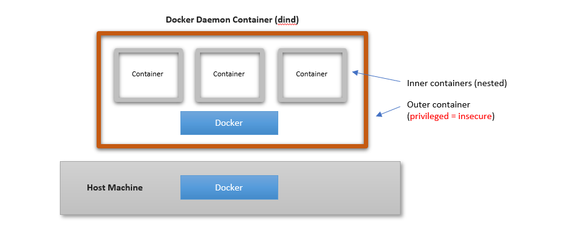

# 초보자를 위한 도커 스웜
> 도커 스웜은 여러 도커 호스트를 클러스터로 묶어주는 컨테인너 오케스트레이션 도구 중에 하나입니다. 기본적으로 여러 호스트에 설치가 되어야만 도커스웜을 통한 배포 및 테스트가 가능하며 이는 docker machine 을 통해 배포할 수 있으나, 맥 환경에서는 virtualbox 드라이버, 윈도우에서는 hyperv 드라이버가 각가 필요하므로 테스트하기에는 불편한 환경이기는 마찬가지 입니다. 그러므로 개발환경에서 도커 스웜을 테스트 하기 위해 구성된 것이 도커 인 도커(Docker in docker, dind)라는 기능이며 본 실습에서는 dind 를 활용하여 배포 및 테스트를 수행합니다.




## 0. 레퍼런스
[도커/쿠버네티스를 활용한 컨테이너 개발 실전 입무](https://wikibook.co.kr/docker-kubernetes/)


## 1. 여러 대의 도커 호스트로 스웜 클러스터 구성하기
* dind 를 통해 컨테이너 안에 5개의 역할 별 컨테이너를 구성합니다
  - registry x 1 : 해당 컨테이너 내에서만 관리되는 이미지 레지스트리 (로컬에 저장되는 이미지와 별도로 등록이 필요합니다)
  - manager x 1  : 스웜 클러스터 전체를 관리하는 역할의 컨테이너
  - worker x 3   : 실제 노드로 동작하는 워커 컨테이너
* 이 환경을 도커 컴포즈 환경으로 구성합니다
  - 도커 레지스트리는 https 통신이 필요하지만 편의상 http 를 사용하기 위해 --insecure-registry registry:5000 으로 등록합니다
```yaml
version: "3"
services:
  registry:
    container_name: registry
    image: registry:2.6
    ports:
      - 5000:5000
    volumes:
      - "./registry-data:/var/lib/registry"

  manager:
    container_name: manager
    image: docker:18.05.0-ce-dind
    privileged: true
    tty: true
    ports:
      - 8000:80
      - 9000:9000
    depends_on:
      - registry 
    expose:
      - 3375
    command: "--insecure-registry registry:5000"
    volumes:
      - "./stack:/stack"

  worker01:
    container_name: worker01
    image: docker:18.05.0-ce-dind
    privileged: true
    tty: true
    depends_on:
      - manager
      - registry 
    expose:
      - 7946
      - 7946/udp
      - 4789/udp
    command: "--insecure-registry registry:5000"

  worker02:
    container_name: worker02
    image: docker:18.05.0-ce-dind
    privileged: true
    tty: true
    depends_on:
      - manager
      - registry 
    expose:
      - 7946
      - 7946/udp
      - 4789/udp
    command: "--insecure-registry registry:5000"

  worker03:
    container_name: worker03
    image: docker:18.05.0-ce-dind
    privileged: true
    tty: true
    depends_on:
      - manager
      - registry 
    expose:
      - 7946
      - 7946/udp
      - 4789/udp
    command: "--insecure-registry registry:5000"
```
* 도커 컴포즈 실행을 통해 컨테이너를 기동합니다
  - 컨테이너 실행 직후에는 여전히 연동된 상태는 아니며 별도의 초기화가 필요합니다
```bash
bash>
docker-compose up -d
```
* 매니저를 등록하고, 모든 워커 노드들을 추가합니다 
  - swarm init 명령어를 통해 매니저 초기화가 수행되고 *해당 호스트는 manager 로 마킹되고 스웜 모드가 활성화*됩니다
  - 활성화 이후에 토큰 키를 저장해 두었다가 해당 토큰을 통해 개별 워커 노드를 추가할 수 있습니다
```bash
bash>  # 스웜 매니저를 초기화합니다
docker container exec -it manager docker swarm init

# Swarm initialized: current node (jriglndy20y71e84odbze5gfj) is now a manager.
# To add a worker to this swarm, run the following command:
#     docker swarm join --token SWMTKN-1-3iyxi7cex388h7jbr6twri4mpj6uxocyuiouh17vcdc5m0ngv9-7lbdl4vspf9117bqn8ilxwiox 172.21.0.3:2377
# To add a manager to this swarm, run 'docker swarm join-token manager' and follow the instructions.


bash>  # 개별 워커들을 추가합니다 (01 ~ 03)
docker container exec -it worker01 docker swarm join \
--token SWMTKN-1-3iyxi7cex388h7jbr6twri4mpj6uxocyuiouh17vcdc5m0ngv9-7lbdl4vspf9117bqn8ilxwiox \
manager:2377
# This node joined a swarm as a worker.
```
