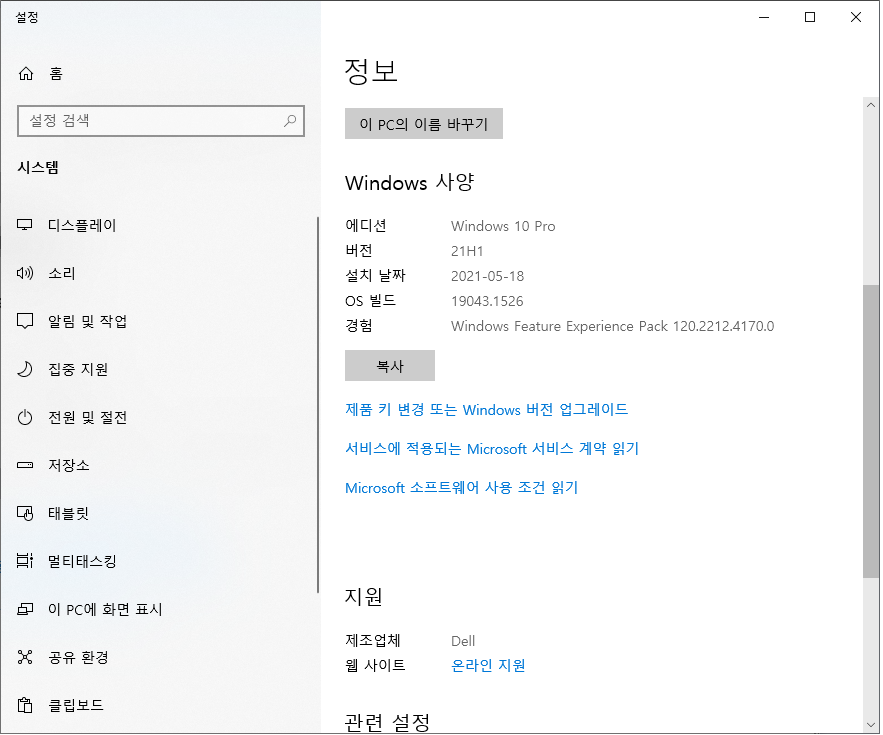
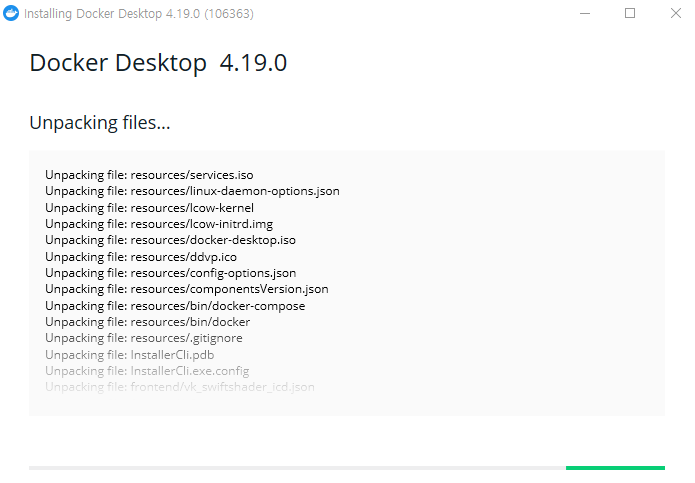
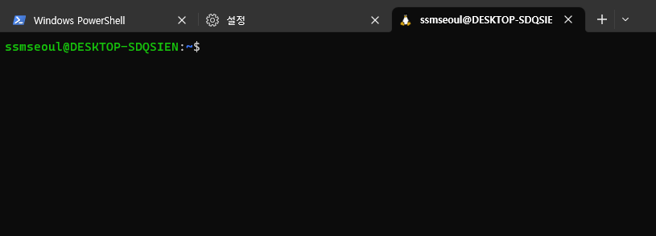
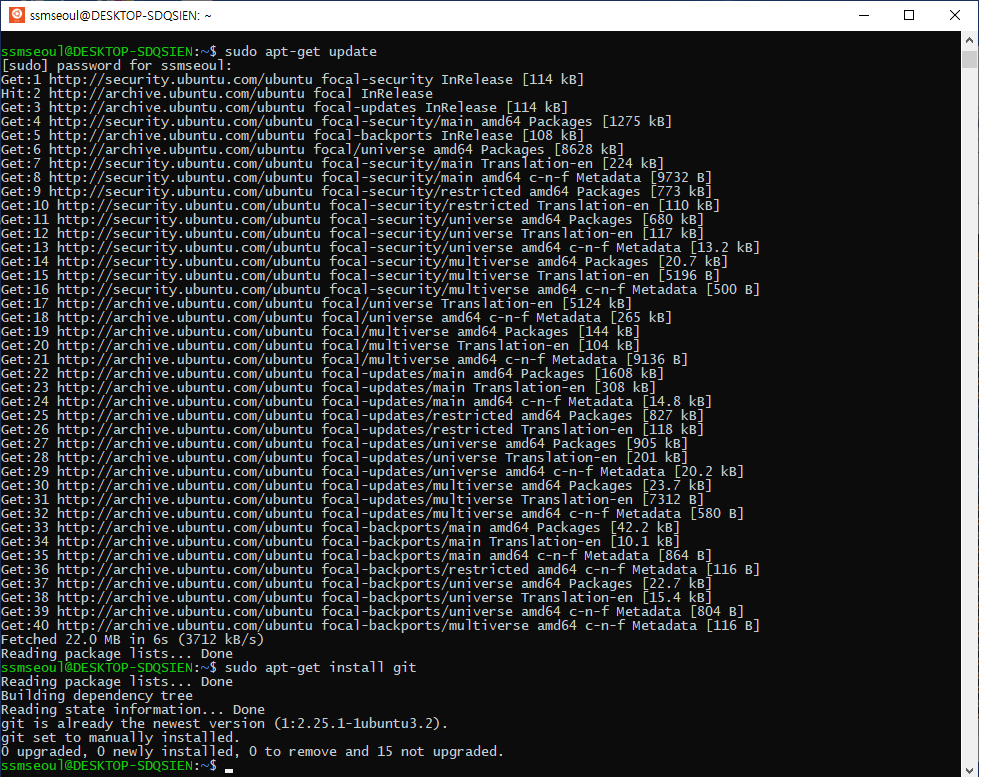

# WSL for Windows

> 윈도우10 환경에서 WSL 구성 튜토리얼 입니다

### 1. 윈도우 버전 확인

#### 1-1. `내 컴퓨터` 정보를 통해서 Windows 버전이 "20H1" 이상 확인



### 2. WSL 이미지 설치

#### 2-1.  '관리자 권한으로 실행' 을 통해' `PowerShell` 명령을 실행


#### 2-2. 'Microsoft-Windows-Subsystem-Linux' 및 'VirtualMachinePlatform' 설치

```bash
dism.exe /online /enable-feature /featurename:Microsoft-Windows-Subsystem-Linux /all /norestart
dism.exe /online /enable-feature /featurename:VirtualMachinePlatform /all /norestart
```


#### 2-3. 'Microsoft Store' 통해서 '터미널' 및 '우분투' 설치


#### 2-4. 'Ubuntu 20.04 LTS' 열기를 통해서 계정 생성 및 초기화

>  다운로드가 완료된 이후에 '열기'를 눌러서 계정 'ssmseoul' 및 패스워드 'ssmseoul' 생성을 합니다


### 3. 도커 설치

#### 3-1. 도커 데스크톱 다운로드 및 설치

> https://www.docker.com/products/docker-desktop/ 페이지에서 운영체제에 맞는 클라이언트 다운로드 및 설치





#### 3-2. 윈도우 재시작 후, 도커 기본 설정

> 재시작 후에 도커 설정 팝업 창에서 'Accept' 선택 후, 아래의 화면과 동일하게 설정


> 'Student' 선택 후 'Continue'


> 우측 상단의 톱니바퀴 아이콘을 눌러서 설정 화면에서 General 탭에서 로그인 시에 도커 시작 체크


> 'Resources 탭의 WSL integration 설정을 누르고 구성된 Ubuntu-20.04 활성화 


> 여기까지 완료 되었다면 우측 하단의 'Apply & restart' 클릭

### 4. WSL 기본 설정

> `PowerShell` 일반 모드로 실행하여 현재 설치된 시스템을 확인합니다

```bash
# 현재 구성된 시스템을 확인
wsl -l -v

# 실행 가능한 시스템이 다수인 경우가 있으므로 명시적으로 우분투 20.04 를 기본 시스템으로 설정
wsl --set-default Ubuntu-20.04 2

# 현재 설치된 리눅스의 버전을 확인
wsl cat /etc/lsb-release
```


### 5. Git 명령어 설치

>  기 설치한 '터미널' 프로그램 실행 및 기본 탭 설정을 '우분투'로 변경


> 기본 탭이 Windows PowerShell 이므로 + 옆의 아래 화살표를 클릭 후 설정 클릭


> 설정의 가장 첫 번째 항목인 '기본 프로필'을 'Ubuntu-20.04' 로 변경


> 설치 및 설정 이후에 시작 경로를 `/home/ssmseoul` 과 같이 HOME 으로 변경합니다


> 우측 상단의 '+' 버튼을 클릭하여 '우분투' 탭을 오픈하여 패키지 업데이트 및 설치를 수행합니다 



```bash
sudo apt-get update
sudo apt-get install git
```



>  설치가 완료되면 아래의 설정으로 기본 이용자 및 이메일 주소를 입력합니다. 깃헙 (github.com) 가입시에 생성한 아이디와 주소를 입력합니다. 임의의 값을 입력하고 추후에 변경이 가능합니다.

```bash
# git 설정 정보 변경
# git config --global user.name "<이름>"
# git config --global user.email "<이메일주소>"
git config --global user.name "ssmseoul"
git config --global user.email "ssmseoul@gmail.com"

# 현재 설정된 정보 출력
git config --list
```

### 6. Docker 컨테이너 테스트

> 동일한 우분투 탭에서 도커 명령어 실행을 통해 컨테이너 확인 및 생성을 합니다

```bash
# 현재 떠 있는 컨테이너 목록을 출력합니다 - 현재는 없어야 정상입니다
docker ps -a
```


```bash
# 도커 테스트를 위한 예제 컨테이너 실행
docker run -d -p 80:80 docker/getting-started

# 정상적으로 컨테이너가 떠 있는지 (RUNNING) 확인
docker ps
```


> 컨테이너가 'RUNNING' 상태라면 크롬 브라우저에서 `http://localhost` 접속 합니다


### 7. 리눅스 설치 오류

> 설치 도중에 아래와 같은 오류로 실패하는 경우 윈도우 재시작 후에 다시 시도합니다


### 8. 도커 이미지 저장소 변경

>  도커의 경우 이미지의 크기가 커질 수 있기 때문에 기본 설정이 `C:\` 드라이브에 구성되므로 이를 저장공간이 충분한 다른 드라이브로 설정이 필요한 경우가 있습니다. 이러한 경우를 대비해서 설치 직후에 변경해 두는 것이 가장 좋습니다

#### 8-1. 실행중인 도커를 종료합니다


> `PowerShell` 에서 컨테이너의 상태를 확인합니다


> '탐색기'에서 저장공간이 충분한 드라이브에 '저장소' 경로를 `D:\Docker\Data` 생성합니다


> 다시 `PowerShell` 에서 기존 데이터를 백업 및 데이터 등록을 해제합니다

```bash
# 기존 데이터 경로는 C:\Users\<user-name>\AppData\Local\Docker\wsl 이며 tar 포맷으로 백업을 합니다
wsl --export docker-desktop-data "D:\Docker\Data\docker-desktop-data.tar"

# 데이터가 저장된 컨테이너를 등록 해제합니다
wsl --unregister docker-desktop-data

# 잘 해제되었는지 확인합니다
wsl -l -v
```


> 백업 데이터를 통해서 새로운 위치에 저장소를 등록합니다

```bash
# 새로운 경로에 백업 데이터를 통해서 데이터 경로를 등록합니다
wsl --import docker-desktop-data "D:\Docker\Data" "D:\Docker\Data\docker-desktop-data.tar" --version 2
```


#### 8-2. 종료된 도커 컨테이너를 다시 기동합니다

> 바탕화면에 생성된 'Docker Desktop' 바로가기를 통해 도커 컨테이너를 기동합니다

