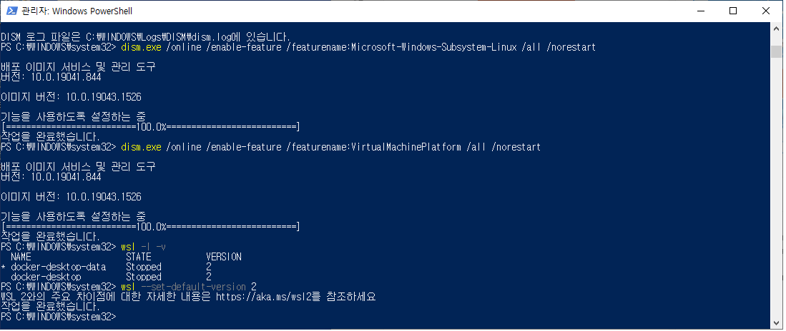
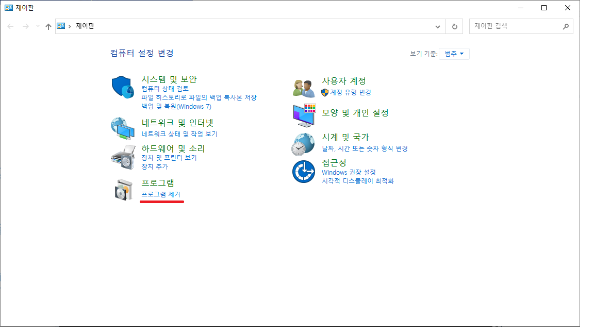
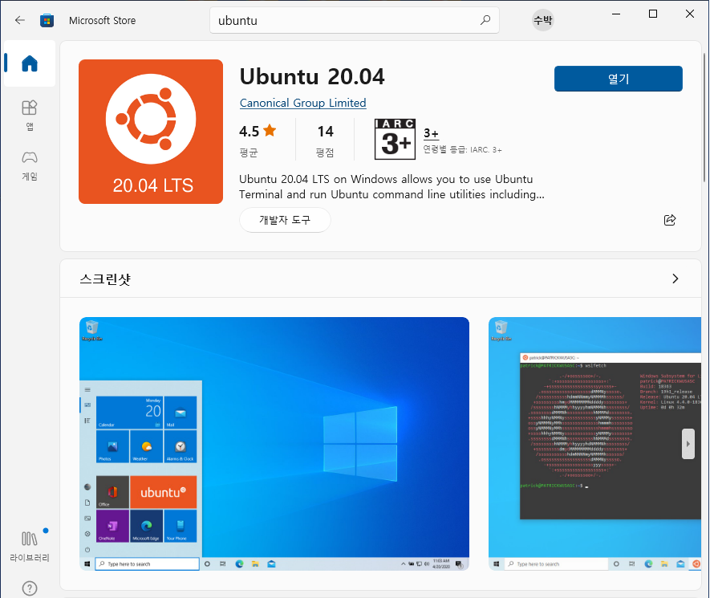
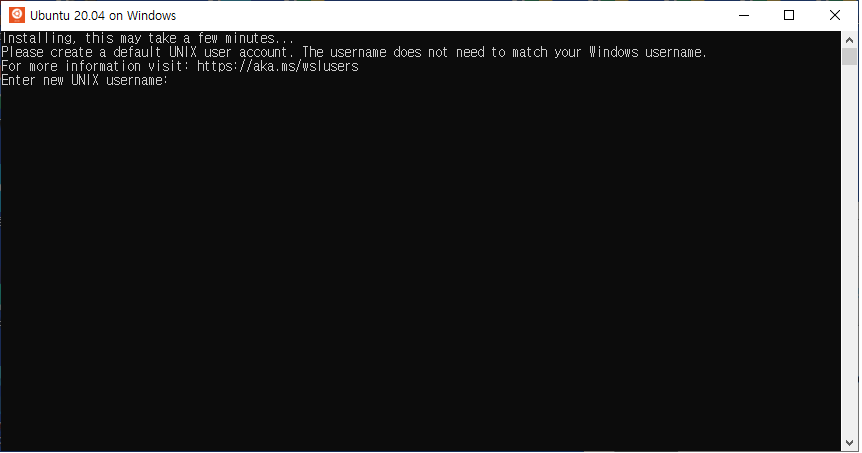
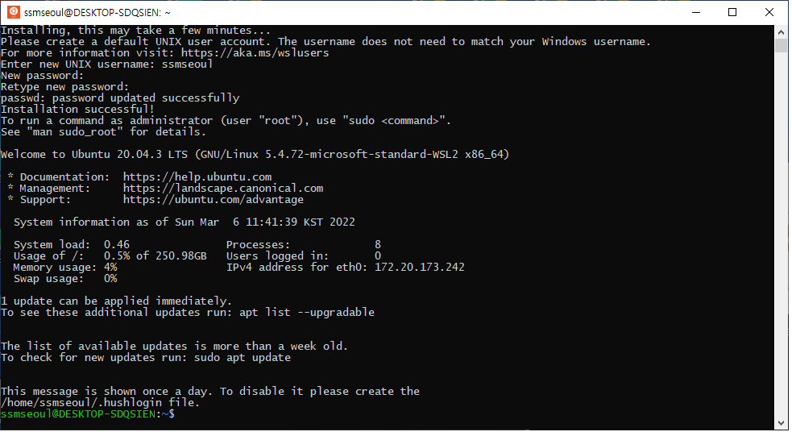

# WSL for Windows
> 윈도우10 환경에서 WSL 구성 튜토리얼 입니다


## 1. 윈도우 버전 확인
> `내 컴퓨터` 정보를 통해서 Windows 버전이 "20H1" 이상이어야 합니다


## 2. WSL 이미지 설치
> `PowerShell` 명령을 통해 필요한 이미지를 설치합니다

```bash
dism.exe /online /enable-feature /featurename:Microsoft-Windows-Subsystem-Linux /all /norestart
dism.exe /online /enable-feature /featurename:VirtualMachinePlatform /all /norestart
```




## 3. 리눅스 설치 오류

> WSL 설정이 되어있지 않은 경우에 아래와 같이 설치에 실패하므로, 변경 후 재시작이 필요합니다





> 제대로 구성이 되었다면 아래와 같이 기본설정을 변경하고, 버전을 확인합니다

```bash
wsl --set-default Ubuntu-20.04 2
wsl -l -v
wsl cat /etc/lsb-release
```


## 4. 리눅스 설치

> `마이크로소프트 스토어` 에서 "Ubuntu 20.04 LTS" 설치 후, WSL 버전 확인 및 변경

```bash
wsl -l -v
wsl --set-version Ubuntu-20.04 2
```



> 계정`ssmseoul` 생성 및 초기화




> 패키지 설치
```bash
sudo apt-get update
sudo apt-get install git
```


> 깃 설정 변경

```bash
git config --global user.name "<이름>"
git config --global user.email "<이메일주소>"
```


## 5. 윈도우 터미널 설치

> 멀티탭 활용을 위해 `마이크로소프트 스토어`에서 "Windows Terminal" 을 설치합니다


> 설치 및 설정 이후에 시작 경로를 `/home/ssmseoul` 과 같이 HOME 으로 변경합니다


## 6. 도커 데스크톱 설치

> 컨테이너 기동을 위해 도커 데스크톱을 설치합니다 


> 정상적으로 설치된 것을 확인하기 위해서 기본 예제 테스트를 수행합니다

```bash
docker run -d -p 80:80 docker/getting-started
```


